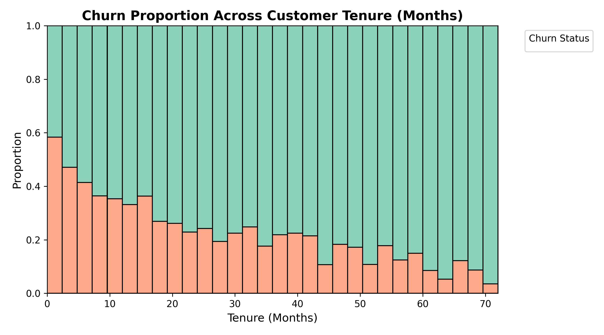
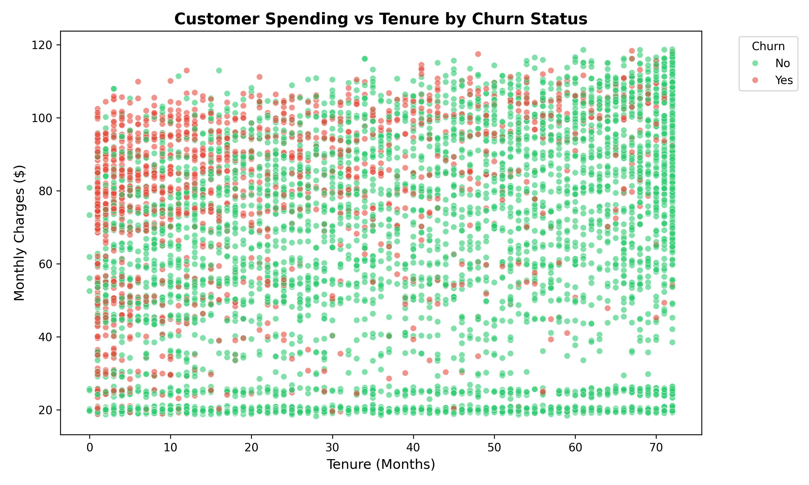
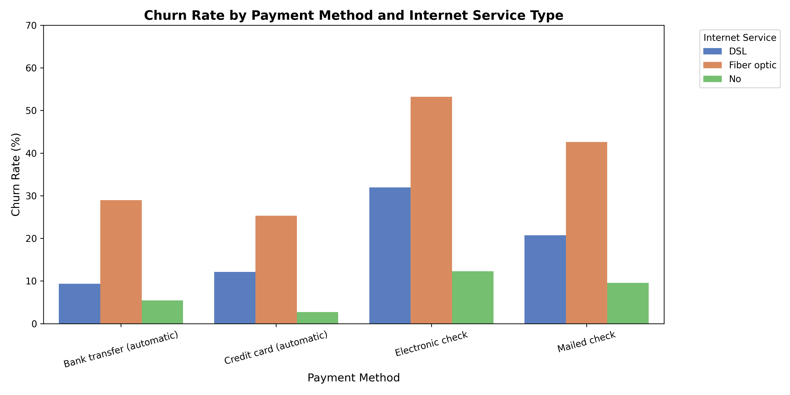
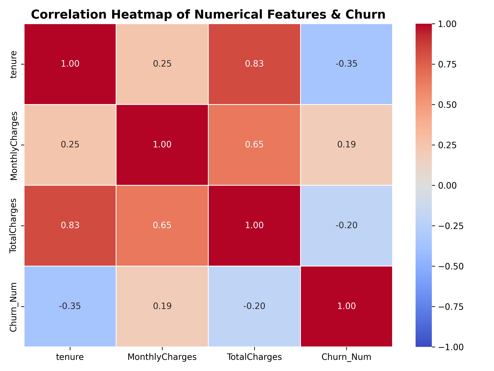
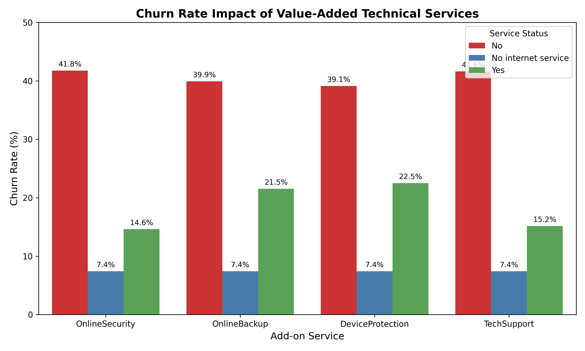
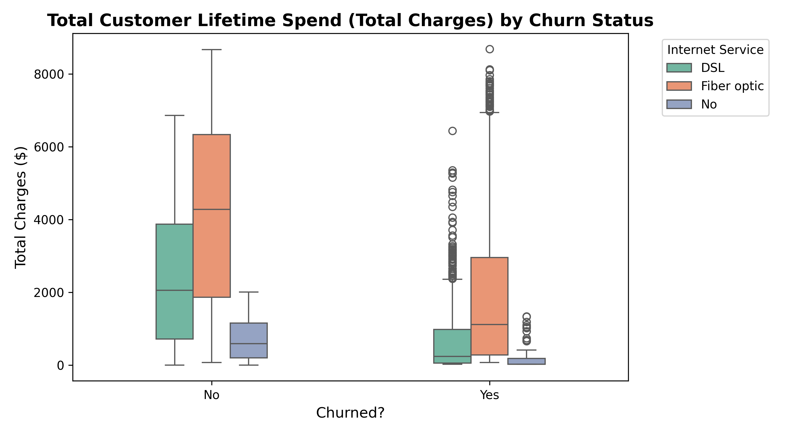

# FUTURE_DS_02
# 📊 Telco Customer Churn Analysis & Retention Strategy

An end-to-end Exploratory Data Analysis (EDA) project uncovering customer churn drivers, behavioral patterns, and actionable retention strategies for subscription-based businesses.

---

## 🚀 Project Overview

Customer churn is a critical challenge for SaaS companies, startups, and telecom providers. Reducing churn directly impacts lifetime value (LTV) and accelerates compounding growth. This repository contains complete data cleaning pipelines, statistical aggregations, and advanced visualizations built on the Telco Customer Churn dataset to answer core business questions:

* **Why are customers leaving the platform?**
* **Which customer segments are most vulnerable to churn?**
* **How long do customers typically stay active before canceling?**
* **What operational actions can product and growth teams take to improve retention?**

---

## 📊 Executive Summary & Key Metrics

* **Overall Churn Rate:** **26.5%** (1,869 out of 7,043 customers left the platform).
* **Revenue Disparity:** Churned customers pay a higher average monthly fee (**$74.44**) compared to retained customers (**$61.27**), indicating high price sensitivity or value mismatch.
* **Tenure Gap:** Retained customers stay active for an average of **37.6 months** (median 38 months), whereas churned customers exit early with a median tenure of only **10 months**.

---
## 🎯 Key Objective

The primary objective of this project is to **analyze customer subscription and behavioral data to understand why customers leave, identify high-risk segments, and formulate data-driven retention strategies that protect recurring revenue and maximize Customer Lifetime Value (CLV).**

Specifically, the project aims to answer four core business questions for product, growth, and retention teams:
1. **Why are customers leaving the platform?** (Pinpointing core churn drivers such as billing methods, contract terms, and pricing thresholds).
2. **Which customer segments are most likely to churn?** (Identifying vulnerable cohorts like new signups within their first year, senior citizens, and accounts lacking security add-ons).
3. **How long do customers typically stay active?** (Mapping customer lifetime patterns, early drop-off windows, and loyalty milestones).
4. **What actions can improve customer retention?** (Delivering actionable, prioritized recommendations to reduce attrition and increase long-term engagement).

---
## 🗂️ Dataset Overview

The dataset (`WA_Fn-UseC_-Telco-Customer-Churn.csv`) contains **7,043 customer records** and **21 variables** spanning demographics, service subscriptions, and billing accounts:

| Column Name | Data Type | Description |
| :--- | :--- | :--- |
| **`customerID`** | Object | Unique customer identifier |
| **`gender`** | Object | Customer gender (Female / Male) |
| **`SeniorCitizen`** | Integer | Senior citizen status (0 = No, 1 = Yes) |
| **`Partner`** | Object | Has a partner (Yes / No) |
| **`Dependents`** | Object | Has dependents (Yes / No) |
| **`tenure`** | Integer | Number of active months with the company |
| **`Contract`** | Object | Contract term (Month-to-month / One year / Two year) |
| **`InternetService`** | Object | Internet provider type (DSL / Fiber optic / No) |
| **`PaymentMethod`** | Object | Billing payment channel (Electronic check, Mailed check, etc.) |
| **`MonthlyCharges`** | Float | Monthly recurring charge amount ($) |
| **`TotalCharges`** | Object/Float | Cumulative lifetime spend amount ($) |
| **`Churn`** | Object | Target variable indicating if the customer left recently (Yes / No) |

---

## 📁 Repository Structure

```text
├── WA_Fn-UseC_-Telco-Customer-Churn.csv    # Raw dataset (Telco customer subscription data)
├── churn_analysis.py                       # Complete Python script for data cleaning & visualization
├── README.md                               # Project documentation & insights guide
└── outputs/                                # Generated high-resolution charts (PNG)
    ├── churn_by_contract.png
    ├── churn_by_tenure_distribution.png
    ├── monthly_charges_vs_tenure.png
    ├── churn_payment_internet.png
    ├── correlation_heatmap.png
    ├── churn_by_addons.png
    └── total_charges_boxplot.png
```

---

## 📈 Key Findings & Insights

* **Overall Churn Rate:** **26.5%** (1,869 out of 7,043 total customers left the platform).
* **The Contract Trap:** Month-to-month subscribers churn at an alarming **42.7%**, compared to just **11.3%** for 1-year contracts and **2.8%** for 2-year agreements.
* **Payment Friction:** Electronic check users exhibit a **45.3%** churn rate, far higher than automated bank transfers (**16.7%**) or credit cards (**15.2%**).
* **Early Tenure Risk:** Median churn occurs around **10 months**, indicating that the first 90–100 days of onboarding are critical for long-term account survival.
* **Value-Added Protection:** Customers lacking technical add-ons like **Online Security** (**41.8%** churn) or **Tech Support** (**41.6%** churn) face nearly triple the cancellation rate of those utilizing these features.
* **Fiber Optic Pricing Pressure:** Fiber optic subscribers account for a **41.9%** churn rate, suggesting potential value mismatch, high pricing expectations, or stiff market competition.

---
## ⏳ Customer Lifetime Patterns
* **The Year 1 Attrition Window:** Peak churn occurs between **0 and 12 months** (47.4% churn rate for new signups). Over 50% of all customer loss occurs within the first year.
* **The Loyalty Zone:** Once customers cross the **24-month (2-year)** threshold, annual churn risk drops sharply, falling below **10%** for users active past 4 years.
* **CLV Impact:** Retained customers accumulate a median lifetime spend of **$1,679.53**, whereas churned customers exit early with a median spend of only **$703.55**.

---

## 💡 Strategic Recommendations

1. **Deploy a "First 90 Days" Onboarding Playbook:** Proactively engage new signups via automated check-ins and support touchpoints before month 3 to prevent early drop-off.
2. **Incentivize Multi-Year Transitions:** Offer promotional discounts or loyalty perks at the 6-month and 11-month marks to convert high-risk month-to-month users into annual agreements.
3. **Migrate Billing Channels:** Drive electronic check users toward automated payment channels by offering one-time billing credits for auto-pay enrollment.
4. **Bundle Technical Protection:** Embed Online Security and Tech Support features into base packages or educate users on setup during onboarding.

## 📊 Visualizations Suite

The analysis script automatically generates 7 publication-ready visual assets to communicate findings across technical and executive stakeholders:
- `churn_by_contract.png :-`Churn rate comparison across contract durations.

- `churn_by_tenure_distribution.png:-` Proportional breakdown of churn across customer lifespan.

- `monthly_charges_vs_tenure.png:-` Scatter plot mapping monthly spend against customer tenure.

- `churn_payment_internet.png:-`  Grouped bar chart analyzing payment friction across internet service tiers.

- `correlation_heatmap.png:-` Numerical correlation matrix of tenure, monthly charges, total spend, and churn.

- `churn_by_addons.png:-` Comparative impact of value-added technical features (Security, Backup, Protection, Support).

- `total_charges_boxplot.png:-` Customer Lifetime Value (CLV) proxy distribution segregated by churn status.


---

## 🛠️ Tech Stack & Dependencies

- Jupyter Notebook
* **Language:** Python
* **Data Manipulation & Analysis:**
* - pandas — data loading, cleaning of category labels, grouping, and aggregation
* - NumPy
* **Data Visualization:**
* - Matplotlib — charts
* - Seaborn — statistical plotting and chart styling
---

## ⚙️ How to Run the Analysis

1. **Clone the repository:**
   ```bash
   git clone https://github.com/your-username/telco-customer-churn-eda.git
   cd telco-customer-churn-eda
   ```

2. **Install required dependencies:**
   ```bash
   pip install pandas numpy matplotlib seaborn
   ```

3. **Obtain the dataset:**
   Place the dataset file `WA_Fn-UseC_-Telco-Customer-Churn.csv` into your root directory (available publicly via Kaggle or IBM Sample Datasets).

4. **Execute the script:**
   ```bash
   python churn_analysis.py
   ```

---

## 💡 Strategic Recommendations for Business Teams

* **Incentivize Long-Term Commitments:** Transition month-to-month users into annual agreements using loyalty incentives, introductory contract pricing, or milestone rewards.
* **Frictionless Billing Migration:** Proactively target electronic check users with small one-time invoice statement credits to migrate them to automated credit card or bank transfer channels.
* **Revamp the 90-Day Onboarding Playbook:** Since median churn spikes at 10 months, introduce automated product education sequences, customer success check-ins, and usage tracking during early tenure.
* **Bundle Protective Services:** Embed Online Security and Tech Support directly into high-tier internet packages to enhance product stickiness and lower churn risk.

---

## 👤 Author

**Malayasis Banerjee**  

Data Analyst Intern | Aspiring Data Analyst
#DataAnalytics #ExploratoryDataAnalysis #FUTUREINTERN
